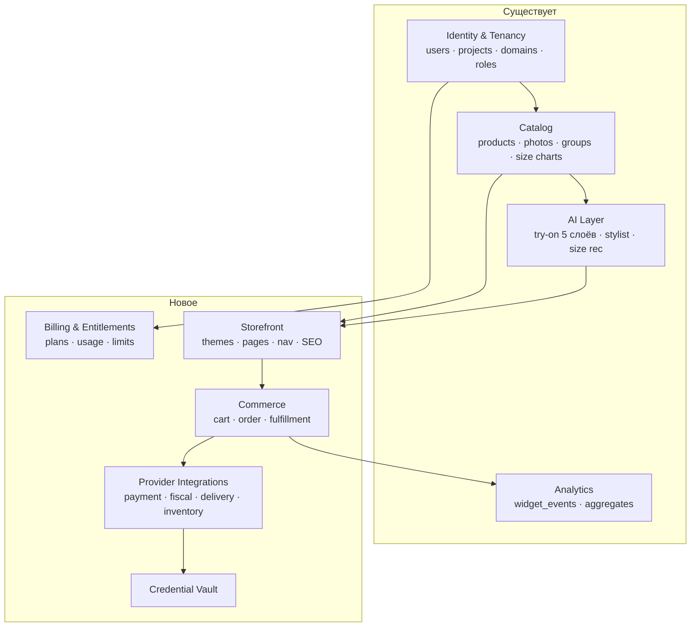
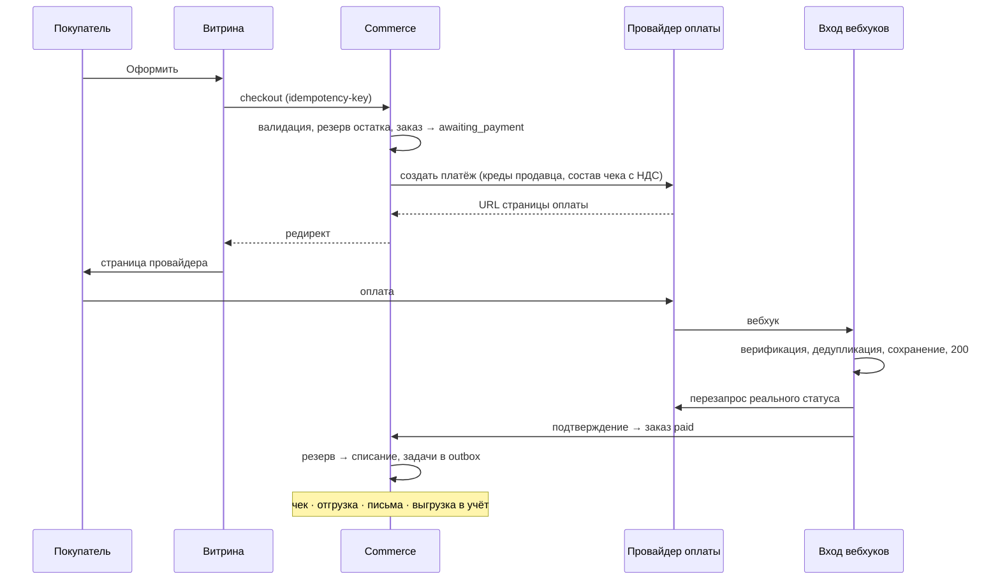

# MakeMeLook — Архитектура платформы запуска магазинов

**Дата:** 2026-07-28
**Статус:** проектное решение, версия 1
**Основание:** `2026-07-28_makemelook-store-builder-regulatory-research.md` (регуляторика и ландшафт), фактический аудит кода `mml-saas-backend` / `mml-saas-frontend` / `platform` / `b2b-frontend`
**Назначение:** единственный источник истины по архитектуре для команды и агентов. Код, противоречащий инвариантам раздела 1, считается багом независимо от того, работает ли он.

---

## 0. Резюме решения

Расширяем **существующий Go-бэкенд виджет-SaaS** до платформы магазинов. Не форкаем OSS-движок. Не заводим новый рантайм. Commerce-ядро (корзина → заказ → платёж → отгрузка) пишем сами как модуль внутри монолита; всё, что специфично для РФ (эквайринг, фискализация, маркировка, логистика, товароучёт) — через порты и адаптеры на кредах продавца.

Ключевая продуктовая рамка, вытекающая из стратегии: **AI-слой — это продукт, магазин — поверхность доставки.** Виджеты обязаны оставаться продаваемыми отдельно и работать на чужих сайтах. Магазин зависит от AI-слоя, AI-слой от магазина — никогда.

---

## 1. Инварианты

Восемь правил, которые не обсуждаются в рамках отдельной задачи. Нарушение — блокирующий дефект.

**И-1. Некастодиальность.** Денежные средства покупателя никогда не поступают на счета MakeMeLook. Платёж инициируется кредами продавца, средства оседают на его расчётном счёте. У нас нет и не появляется счетов для клиентских денег.
*Почему структурно:* третий признак определения «владельца агрегатора» (ЗоЗПП, ст. 9 п. 1.2) прямо привязан к получению предоплаты платформой. Не получаем — признак не выполняется.

**И-2. Мы не видим и не храним данные карт.** В нашей вёрстке нет и не может быть полей номера карты, срока и CVV. Только редирект на страницу провайдера или его собственный встраиваемый виджет.
*Немедленное следствие:* карточные поля в `b2b-frontend/src/app/shop/checkout/CheckoutClient.tsx` подлежат удалению до того, как этот файл станет чем-то, кроме макета. Это мина.

**И-3. Один магазин = один продавец = один юридический продавец.** Витрина мерчанта показывает только его товары. Кросс-брендовая выдача живёт исключительно на платформе MakeMeLook по CPA-модели и никогда не смешивается с магазином мерчанта.
*Почему:* признак множественности продавцов — второй независимый аргумент против агрегаторского статуса. Смешаем — потеряем оба.

**И-4. Креды продавца — его собственность, у нас на хранении.** Шифруются конвертным шифрованием, доступ аудируется, при отключении затираются, в логи не попадают никогда — ни в каком виде, ни в отладочном.

**И-5. Мы не реестр маркировки.** Код маркировки — опциональное сквозное поле позиции заказа, передаваемое в систему продавца и/или в чек. Мы не храним инвентарь кодов, не управляем их статусами и не отвечаем за вывод из оборота. Остаток — целое число на SKU.

**И-6. Деньги — целые числа в копейках.** Валюта явная на каждой сумме. Плавающая точка в денежных расчётах запрещена.

**И-7. AI-слой автономен.** Примерка, стилист и рекомендация размера не имеют зависимостей от модулей магазина и остаются работоспособными как embed на произвольном сайте.

**И-8. Ранжирование не продаётся.** Позиция товара или бренда в выдаче стилиста, в подборе и в любой рекомендации определяется только соответствием запросу покупателя. Оплаченного приоритета не существует как продукта, и в модели данных нет и не появляется поля, способного его выразить. Вознаграждение платформы — процент от состоявшейся продажи, одинаковый для всех участников.
*Почему инвариант, а не политика:* треть покупателей уже опасается, что ИИ показывает не лучшие товары, а выгодные продавцу; конкуренты на этом рынке продают приоритет в выдаче с первого дня. Отличие может быть только структурным — если его можно отменить решением менеджера, оно ничего не стоит.

---

## 2. Границы контекстов



Направление зависимостей — сверху вниз. `AI → SF` означает: витрина использует AI-слой, но не наоборот (И-7). `COM → PRV → VAULT` — коммерция ничего не знает о конкретных провайдерах, только о портах.

---

## 3. Архитектурные решения (ADR)

### ADR-001 — Commerce-ядро пишем сами, OSS-движок не форкаем

**Контекст.** Нужны корзина, заказы, платежи, отгрузки. Кандидаты: Medusa (MIT), Saleor (BSD-3), Vendure (GPLv3), Spree (мультимагазинность под AGPL/коммерческой — выбывает).

**Рассмотрено.**
*Форк Medusa/Saleor:* даёт готовые корзину, заказы, промо, инвентарь, admin API. Цена: новый рантайм (Node или Python) четвёртым в стеке рядом с Go/React/Python-reco; каталог раздваивается между нашей БД и движком, и синхронизация между ними — вечный налог; их абстракции платежей и фулфилмента спроектированы под Stripe-образных провайдеров, российской фискализации в их модели нет как класса; всё, что специфично для РФ, всё равно писать с нуля; плюс миграция существующих тенантов.
*Своё ядро в существующем Go-бэкенде:* переиспользует мультитенантность, каталог, аутентификацию, админку, публичный storefront API. Цена: сами пишем 15–20 таблиц и конечный автомат заказа.

**Решение.** Своё ядро. Основной аргумент: у нас **уже есть** самая дорогая часть — мультитенантность и каталог с эмбеддингами, категорийной коэрцией и размерными сетками; а самая дорогая часть предстоящего — не корзина, а российские интеграции, которых нет ни в одном движке. Форк даёт нам то, что дёшево, и не даёт того, что дорого, добавляя при этом постоянный налог на синхронизацию и рантайм.

**Последствия.** Проще: единый стек, единая БД, единая модель каталога, никакого ребейза на апстрим. Сложнее: промо, подарочные карты, B2B-прайс-листы, мультивалютность придётся писать самим, если понадобятся — в v1 они не нужны и сознательно не делаются. Модель корзины и заказа заимствуем концептуально у зрелых движков, не изобретая семантику.

---

### ADR-002 — Модульный монолит, границы модулей строгие

**Контекст.** Команда маленькая. Микросервисы дадут операционную сложность, которую некому нести.

**Решение.** Один деплой, внутри — модули с явными границами: пакет не импортирует внутренности чужого модуля, только его публичный интерфейс. Каждый модуль владеет своими таблицами; кросс-модульное чтение — через сервисный интерфейс, а не через JOIN в чужую таблицу.

**Последствия.** Если когда-нибудь понадобится вынести модуль в сервис — границы уже проведены, миграция механическая. Дисциплину границ придётся поддерживать ревью, компилятор её не обеспечит.

---

### ADR-003 — Некастодиальность обеспечивается структурно, а не регламентом

**Решение.** Инварианты И-1 и И-2 закрепляются в коде, а не в документации:
- в модели `payment` нет и не появляется полей, способных нести данные карты;
- допустимые режимы платежа ограничены перечислением `redirect | provider_widget` — режима «наша форма» не существует как значения;
- CI-проверка: паттерны `cardNumber|cvv|pan|expiry` в директориях витрины и чекаута — красный билд.

**Последствия.** Мы вне области PCI DSS сверх SAQ-A. Мы теряем возможность полностью контролировать UX оплаты — принимаем сознательно.

---

### ADR-004 — Хранилище кредов: конвертное шифрование, ключ на проект

**Контекст.** Мы будем хранить эквайринговые секреты, токены ОФД, ключи СДЭК, доступы к МойСклад. Это самый ценный актив в системе и самая тяжёлая ответственность.

**Решение.**
- Мастер-ключ вне БД (KMS или, на старте, ключ из окружения с планом миграции в KMS).
- На каждый проект генерируется DEK; креды шифруются DEK, DEK шифруется мастер-ключом и хранится рядом.
- Доступ к расшифровке — только через сервис `credential`, с обязательным аргументом «зачем» (операция-инициатор), пишущим запись в аудит.
- Структурная защита от утечки в логи: секреты представлены типом с переопределённым методом форматирования, возвращающим маску. Секрет невозможно случайно напечатать.
- Отключение провайдера затирает шифротекст, а не помечает флагом.

**Последствия.** Компрометация одного проекта не раскрывает остальные. Ротация мастер-ключа возможна без перешифровки всех кредов (перешифровываются только DEK).

---

### ADR-005 — Порты и адаптеры с декларацией возможностей

**Контекст.** Провайдеры не эквивалентны. Из ресерча: ЮKassa, Т-Банк и Робокасса несут код маркировки нативно в платёжном API; CloudPayments для этого требует отдельного продукта CloudKassir. Схемы верификации вебхуков различаются у всех четырёх принципиально.

**Решение.** Четыре порта — `PaymentProvider`, `FiscalProvider`, `DeliveryProvider`, `InventoryProvider`. Каждый адаптер вместе с реализацией **декларирует возможности**: несёт ли чек, несёт ли код маркировки, поддерживает ли частичный возврат, есть ли песочница.

Возможности используются в рантайме, а не только в документации:
- визард не предлагает несовместимые комбинации;
- при попытке продавца с маркированными категориями подключить провайдера без поддержки кода маркировки — блокирующее предупреждение с объяснением и альтернативой;
- предполётная проверка перед публикацией магазина: «выбранная связка не сможет выбить корректный чек по вашим товарам».

**Последствия.** Регуляторные знания из ресерча превращаются в исполняемые правила, а не в записку, которую забудут. Добавление провайдера — новый пакет плюс регистрация, без правок ядра.

---

### ADR-006 — Единый вход вебхуков: проверить, дедуплицировать, сохранить, обработать асинхронно

**Контекст.** Четыре схемы подлинности: у ЮKassa — список IP плюс обязательный повторный запрос статуса через API (подписи нет); у Т-Банка — токен через сортировку и конкатенацию корневых полей с паролем и SHA-256; у CloudPayments — HMAC-SHA256 в заголовке; у Робокассы — MD5-подпись по схеме мерчанта.

**Решение.** Один HTTP-вход, дальше конвейер: определить провайдера и тенанта по пути → верифицировать провайдер-специфичным верификатором → сохранить сырое тело и заголовки в `webhook_events` → ответить 200 немедленно → обработать асинхронно.

Отдельное правило, прямо следующее из документации ЮKassa: **тело вебхука не является источником истины о состоянии платежа.** После получения события состояние перезапрашивается у провайдера через API. Вебхук — это сигнал «сходи посмотри», а не «вот факт».

Идемпотентность — по составному ключу «провайдер + идентификатор события». Повтор от провайдера не создаёт второго эффекта.

**Последствия.** Возможность воспроизвести любой инцидент по сырым событиям. Верификаторы изолированы — общий код между ними намеренно не переиспользуется, попытка обобщить эти четыре схемы даст ложную абстракцию.

---

### ADR-007 — Транзакционный outbox для исходящих эффектов

**Контекст.** Оплата подтверждена — дальше нужно: выбить чек, создать отгрузку, списать остаток, отправить письмо покупателю и продавцу, толкнуть заказ в МойСклад. Часть этих вызовов упадёт. Терять их нельзя, дублировать — тоже.

**Решение.** Смена состояния заказа и запись задач в `outbox` происходят в одной транзакции БД. Воркеры разбирают outbox с экспоненциальными повторами и dead-letter. Каждая задача идемпотентна по ключу.

**Последствия.** «Оплата прошла, а чек не выбился» превращается из тихой потери в видимую задачу с повторами и алертом.

---

### ADR-008 — Явный конечный автомат заказа

**Решение.** Состояния и разрешённые переходы описаны данными, не разбросаны по коду. Каждый переход пишет запись в историю: кто, когда, почему, каким событием вызван.

```
draft → awaiting_payment → paid → assembling → shipped → delivered → completed
                 ↓             ↓         ↓
             cancelled     refunded  cancelled
```

Переход в `paid` возможен только из подтверждённого статуса, полученного повторным запросом к провайдеру (ADR-006), и только он открывает фискализацию и резерв→списание.

**Последствия.** Поддержка отвечает на «что случилось с заказом» историей, а не чтением логов.

---

### ADR-009 — Витрина: редактор секций, не свободный холст

**Контекст.** Термином «редактор» называют три разные вещи, и их надо развести. **(1) Токены:** выбрал тему, поменял цвета, логотип, шрифт. **(2) Редактор секций:** шаблоны по типам страниц, внутри — состав секций с добавлением, удалением и переупорядочиванием, настройки каждой секции, предпросмотр, история версий. Так устроены Shopify и Яндекс KIT. **(3) Свободный холст:** блок таскается куда угодно — Tilda, Webflow.

Первая версия этого решения ограничивалась уровнем (1). Это была ошибка масштаба, исправлена после разбора живого интерфейса конкурента.

**Решение.** Уровень (2). Уровень (3) не делаем никогда.

Состав: шаблоны для главной, каталога, карточки товара и произвольной страницы; состав секций внутри шаблона; настройки секции по типизированной схеме; предпросмотр в двух разрешениях на реальных данных магазина; история версий с откатом; раздельные сохранение и публикация. **Каталог типов секций пишем мы** — продавец из них собирает, но не создаёт свои и не вставляет произвольный HTML или CSS.

**Обоснование, почему уровня (1) недостаточно.** Позиционирование платформы построено на том, что маркетплейс обезличивает бренд, а у нас бренд остаётся собой. Если все магазины различаются только логотипом и цветом — это то же обезличивание, и противоречие вскроется на первой демонстрации. Плюс редактор секций стал гигиеной рынка: он есть у бесплатного конкурента и у мирового стандарта.

**Темы делаем и тестируем мы, не генерируем.** Четыре готовые темы под разные характеры брендов одежды. Генерация оформления нейросетью отклонена: качество непредсказуемо, а продавец судит о платформе по первому экрану. AI остаётся в опыте покупателя — примерка, стилист, размеры — и не заходит в инструменты админки.

**Наше отличие внутри редактора.** Каталог секций включает те, которых у конкурентов быть не может: примерка, подбор образа стилистом, «с этим носят» на эмбеддингах, примерка внутри информационного блока карточки. Плюс собственные типы страниц — Примерочная, Стилист, Мои образы.

**Последствия.** Проще: продавец получает узнаваемый магазин, позиционирование перестаёт быть декларацией. Сложнее: схемы секций, состояние черновика, версионирование и рендеринг предпросмотра — несколько недель сверх исходного плана фазы 1. Компенсируется переносом коллекций и баннеров в фазу 5: без них магазин работает, без редактора — нет.

Привязка шаблона к подмножеству товаров (у конкурента — «привязано 12 карточек») полезна брендам с разнородным ассортиментом, но в первую версию не входит.

---

### ADR-010 — Резолвинг тенанта по домену

**Контекст.** Сейчас `project_domains` — только список разрешённых источников для виджета (CORS и проверка происхождения). Витрине нужен обратный механизм: по хосту определить, чей магазин рендерить.

**Решение.** Таблица расширяется полем роли: `widget_origin` (текущее поведение) либо `storefront_host` (новое). Домен в роли витрины резолвится в тенанта на входе. Каждому магазину сразу выдаётся системный поддомен, свой домен подключается по DNS с автоматическим TLS.

**Последствия.** Существующее поведение виджета не ломается — расширение аддитивное.

---

### ADR-011 — Маркировка проходит насквозь

**Решение.** У позиции заказа есть опциональное поле кода маркировки. Оно заполняется системой продавца (МойСклад, SelSup, 1С) либо вручную при сборке и передаётся дальше — в чек через платёжного или кассового провайдера. Мы не храним инвентарь кодов и не подаём документы вывода из оборота.

**Обоснование режима.** Для e-commerce с курьерской доставкой действует режим дистанционной торговли: синхронная проверка кода на кассе и модуль ТС ПИОТ не требуются, документ вывода подаёт продавец в течение трёх рабочих дней. Подтверждение архитектурной достаточности — форма товара Яндекс KIT, где остаток является простым числом, а поля кода маркировки нет вовсе.

**Последствия.** Мы не берём на себя ответственность за вывод из оборота (штрафы по КоАП 15.12 — до 300 тысяч и конфискация партии — остаются на продавце как участнике оборота). Продавцу, торгующему маркированным товаром, обязателен подключённый товароучёт — это условие подключения, проверяемое предполётной проверкой.

---

### ADR-012 — Персональные данные покупателя изолированы

**Контекст.** 152-ФЗ: первичный сбор ПДн граждан РФ — в базах, физически расположенных в России; с 1 июля 2025 формулировка ужесточена. Плюс требуется регистрация оператора в реестре Роскомнадзора до начала обработки.

**Решение.** Контакты и адреса покупателей — в отдельной схеме на RU-хостинге, с шифрованием контактных полей на уровне поля. Согласия фиксируются с версией текста и отметкой времени (механика уже существует на платформе — `consent_logs`). Заданы сроки хранения и реализованы выгрузка и удаление по запросу субъекта. Мы — обработчик по поручению продавца; шаблон поручения включается в договор с мерчантом.

**Последствия.** Аналитика работает на псевдонимизированных идентификаторах, а не на контактах.

---

### ADR-013 — Полноценная песочница как продуктовое отличие

**Контекст.** У конкурента песочницы нет — интерфейс прямо предупреждает, что тестовый заказ будет реальной сделкой с реальной оплатой и доставкой.

**Решение.** Режим песочницы на уровне магазина: тестовые креды провайдеров, заказы помечены и не попадают в отчётность, фискализация и создание отгрузки замещаются заглушками, письма уходят только владельцу. Переход в боевой режим — явное действие с предполётной проверкой.

**Последствия.** Продавец проверяет весь путь, ничем не рискуя. Это дешёвая и заметная разница в опыте на фоне более крупного конкурента.

---

## 4. Модель данных

Только новые и изменяемые сущности. Существующие (`users`, `projects`, `products`, `widget_configs`, `leads`, …) сохраняются.

### Магазин и оформление

| Таблица | Ключевые поля | Назначение |
|---|---|---|
| `stores` | `project_id`, `slug`, `status(draft/sandbox/published)`, `theme_id`, `settings`, `legal_entity` | Один магазин на проект |
| `store_themes` | `code`, `category`, `template_version` | Каталог тем, код |
| `store_theme_tokens` | `store_id`, `tokens jsonb` | Переопределения тенанта (то же семейство, что и токены виджета) |
| `store_pages` | `store_id`, `page_type`, `slug`, `is_hidden`, `seo` | Инвентарь страниц: системные, юридические, произвольные |
| `store_templates` | `store_id`, `page_type`, `name`, `is_default`, `priority` | Несколько раскладок на тип страницы; порядок решает конфликты назначения |
| `template_rules` | `template_id`, `attribute`, `operator`, `value` | Правила назначения: категория, бренд, коллекция, тип одежды, маркировка |
| `template_overrides` | `template_id`, `product_id` | Ручное назначение шаблона товару, побеждает правила |
| `store_sections` | `template_id`, `type`, `position`, `settings jsonb`, `is_hidden` | Состав шаблона |
| `store_section_blocks` | `section_id`, `type`, `position`, `settings jsonb` | Повторяемые блоки внутри секции |
| `store_versions` | `store_id`, `snapshot jsonb`, `published_at`, `author_id`, `summary` | История публикаций с откатом |
| `store_nav` | `store_id`, `items jsonb` | Меню, фильтры |
| `project_domains` *(изменяется)* | **+ `role`**, `is_primary`, `tls_status` | Расширение существующей таблицы (ADR-010) |

### Каталог (расширение существующих)

| Таблица | Добавляется | Почему |
|---|---|---|
| `products` | `vat_rate`, `measure_unit`, `payment_subject`, `marking_required` | Обязательные реквизиты фискального чека |
| `product_variants` **(новая)** | `product_id`, `sku`, `size`, `color`, `barcode`, `price`, `stock` | Сейчас размеров нет; для заказа вариант обязателен |
| `stock_reservations` **(новая)** | `variant_id`, `order_id`, `qty`, `expires_at` | Мягкий резерв против оверселла |

### Коммерция

| Таблица | Ключевые поля |
|---|---|
| `carts` | `store_id`, `token`, `customer_id?`, `expires_at` |
| `cart_items` | `cart_id`, `variant_id`, `qty`, `unit_price_kop` |
| `customers` | `store_id`, `email_enc`, `phone_enc`, `consent_id` — отдельная схема (ADR-012) |
| `addresses` | `customer_id`, поля адреса, `pickup_point_code?` |
| `orders` | `store_id`, `number`, `status`, `total_kop`, `currency`, `idempotency_key` |
| `order_items` | `order_id`, `variant_id`, `qty`, `unit_price_kop`, `vat_rate`, **`marking_code?`** |
| `order_status_history` | `order_id`, `from`, `to`, `actor`, `reason`, `event_id` |
| `payments` | `order_id`, `provider`, `provider_payment_id`, `status`, `amount_kop`, `mode(redirect/widget)` — **без единого поля, способного нести данные карты** |
| `refunds` | `payment_id`, `amount_kop`, `status`, `reason` |
| `fiscal_receipts` | `order_id`, `provider`, `kind(sale/refund)`, `status`, `payload_hash`, `fiscal_doc_id?` |
| `shipments` | `order_id`, `provider`, `tracking_number`, `status`, `pickup_point?`, `cost_kop` |

### Инфраструктурные

| Таблица | Назначение |
|---|---|
| `provider_connections` | `project_id`, `kind`, `provider`, `status`, `capabilities`, `is_sandbox` |
| `credentials` | `connection_id`, `ciphertext`, `dek_wrapped`, `key_version`, `rotated_at` |
| `credential_access_log` | Кто, когда, какой операцией расшифровал |
| `webhook_events` | `provider`, `provider_event_id` **(уникальный составной)**, `raw_body`, `headers`, `verified`, `processed_at` |
| `outbox` | `aggregate`, `task_type`, `payload`, `attempts`, `next_retry_at`, `status` |
| `plans` / `subscriptions` / `entitlements` / `usage_counters` | Тарификация и лимиты (сейчас отсутствуют полностью) |

---

## 5. Структура кода

```
mml-saas-backend/internal/
├── commerce/
│   ├── cart/                 # корзина, резервы
│   ├── order/                # агрегат заказа + конечный автомат
│   ├── checkout/             # оркестрация оформления
│   └── pricing/              # итоги, НДС, доставка
├── store/                    # магазин, темы, страницы, навигация, SEO
├── tenant/                   # резолвинг домен → проект
├── provider/
│   ├── registry.go           # реестр + декларация возможностей (ADR-005)
│   ├── payment/              # порт + yookassa/ tbank/ cloudpayments/ robokassa/
│   ├── fiscal/               # порт + ferma/ cloudkassir/ atol/
│   ├── delivery/             # порт + cdek/
│   └── inventory/            # порт + moysklad/ selsup/
├── credential/               # хранилище секретов (ADR-004)
├── webhookin/                # вход вебхуков: verify → dedupe → dispatch
├── outbox/                   # транзакционный outbox + воркеры
├── billing/                  # тарифы, права, потребление
└── (существующие: auth, project, product, widget, analytics, ecommerce, installation)
```

Витрина — существующее Next.js-приложение `b2b-frontend/src/app/shop`, которому снимается захардкоженный идентификатор проекта и добавляется резолвинг тенанта по заголовку хоста.

Админка — существующее React-приложение, куда добавляются разделы: Магазин (тема, страницы, меню, домен), Заказы, Подключения (оплата, касса, доставка, учёт), Тариф. Разделы включаются правами тарифа: продавец на виджетном тарифе их не видит.

---

## 6. Ключевые потоки

### Оформление заказа



Отдельно отмечено: **состав чека с НДС уходит вместе с созданием платежа.** Это то место, где данные каталога становятся фискальным документом, и потому поля НДС и признака предмета расчёта обязательны на товаре, а не желательны.

### Упрощение, которое даёт ресерч

Из раздела 5 базы знаний следует, что ЮKassa, Т-Банк и Робокасса несут состав чека и код маркировки **нативно в платёжном API**. Значит для первой версии отдельная интеграция с кассовым провайдером **не нужна вовсе**: фискализация едет на платеже. Ferma, CloudKassir и АТОЛ становятся не фазой один, а опцией для продавцов с уже подключённой собственной кассой.

Это снимает с плана целую интеграцию. Порт `FiscalProvider` при этом проектируется сразу — но его первой реализацией становится адаптер «фискализация через платёжного провайдера».

---

## 7. Что переиспользуется

| Актив | Состояние | Действие |
|---|---|---|
| Мультитенантность `users → projects` | Рабочая | Переиспользовать как есть |
| Публичный storefront API `/api/storefront/v1/{projectPublicId}/...` | Рабочий, уже мультитенантный | Расширить вариантами и остатками |
| Витрина `b2b-frontend/shop` | ~70%: каталог, фильтры, карточка, галерея, похожие | Снять хардкод проекта, подключить темы |
| Токены и пресеты оформления виджета | Рабочие, с живым превью | Расширить на витрину (ADR-009) |
| `project_domains` с верификацией | Рабочая как allow-list | Добавить роль витрины (ADR-010) |
| Импорт каталога: CSV, CS-Cart, OpenCart, custom feed, YML на платформе | Пять путей рабочих | Перенести YML в SaaS, добавить МойСклад |
| CPA-контур платформы: подписанные редиректы, постбэки | Рабочий | Основа фазы 1 (витрина без денег) |
| Виджеты примерки и стилиста | Рабочие | Встроить как первоклассные элементы витрины |
| Корзина виджета `lead_cart_items` | Это список интереса, не корзина | Не путать с `carts`, оставить как метрику намерения |
| Макет чекаута с полями карты | Макет | **Удалить поля карты** (И-2) |

---

## 8. Фазы

Порядок подчинён стратегии: сначала дёшево проверить спрос, потом дорого строить деньги.

**Фаза 0 — фундамент.** Тарифы и права (сегодня взять деньги технически нечем). Хранилище кредов. Резолвинг тенанта по домену, системные поддомены, автоматический TLS.
*Готовность:* продавец видит свой магазин на своём поддомене; можно выставить счёт.

**Фаза 1 — витрина без денег.** Темы, страницы, меню, SEO. Варианты товара. Виджеты встроены нативно. Кнопка покупки ведёт в существующую коммерцию продавца через CPA-контур платформы.
*Готовность:* магазин можно продавать и показывать. **Это точка проверки гипотезы до вложений в коммерцию.**

**Фаза 2 — коммерческое ядро.** Корзина, покупатель, заказ, конечный автомат, outbox. ЮKassa — только редирект. Фискализация через платёж. Письма. Сборка вручную.
*Готовность:* магазин принимает реальные заказы с легальным чеком.

**Фаза 3 — доставка и второй эквайринг.** СДЭК: тарифы, выбор пункта выдачи, регистрация заказа, трекинг. Т-Банк вторым провайдером. Возвраты.

**Фаза 4 — учёт и маркировка.** МойСклад: остатки в обе стороны, выгрузка заказов. SelSup для пришедших с маркетплейсов. Сквозное поле кода маркировки. 1С — только по запросу и только через существующие протоколы обмена.

**Фаза 5 — операционная зрелость.** Брошенные корзины, промокоды, отзывы, инструменты SEO, аналитика магазина.

---

## 9. Чего не делаем сознательно

Список так же важен, как и план.

Не делаем блочный редактор страниц. Не делаем мультивалютность и трансграничную торговлю. Не делаем маркетплейс внутри магазина мерчанта (И-3). Не делаем собственный процессинг и кошельки (И-1). Не делаем реестр кодов маркировки (И-5). Не делаем поддержку 1С как галочку в визарде — только по запросу, иначе она превратится в отдел. Не делаем Boxberry, пока идёт его слияние в Yandex Delivery и документация нестабильна. Не делаем свою BNPL. Не берём на себя первую линию поддержки чужих настроек — интерфейс подключения обязан диагностировать и объяснять ошибку провайдера сам, иначе поддержка съест команду.

---

## 10. Риски

| Риск | Проявление | Что делаем |
|---|---|---|
| **Юридический статус агрегатора** | Признают агрегатором — появляется ответственность за возврат предоплаты | Письменное заключение юриста **до** проектирования чекаута фазы 2. И-1 и И-3 — оба аргумента защиты. Блокирует фазу 2, не блокирует фазы 0–1 |
| **Стоимость поддержки на продавца** | Каждый клиент съедает дни на отладку чужих интеграций | Мерить с первого пилота. Порог: если больше нескольких часов в месяц на продавца — модель коробки не масштабируется, разворачиваемся в партнёрство |
| **Конкурент вносит AI-примерку в свой конструктор** | Дифференциация исчезает | Окно не бесконечно. Держать преимущество там, где его труднее скопировать: пять слоёв и рекомендация размера по сеткам бренда, а не сам факт примерки |
| **Утечка кредов продавцов** | Экзистенциальный | ADR-004, аудит доступа, отсутствие секретов в логах как свойство типа, регулярная ротация |
| **Оверселл** | Продали то, чего нет | Мягкий резерв со сроком жизни, единый источник истины по остатку, сверка с учётом |
| **Расфокус команды** | Магазин съедает время AI-слоя — того, ради чего всё | Фаза 1 намеренно дешёвая. Решение о фазе 2 принимается по данным фазы 1, а не по инерции плана |

---

## 11. Открытые вопросы

Юридическое заключение по агрегаторскому статусу — на критическом пути, запускать немедленно, идёт неделями независимо от разработки. Реализован ли модуль ТС ПИОТ у кассовых провайдеров — уточнить, хотя для курьерского сценария не требуется (ADR-011). Точный скоуп API конкурента и протокол агентной коммерции — отдельная ветка исследования: возможно, встройка в чужую экосистему окажется дешевле и ценнее собственного конструктора, и этот вариант должен оставаться живым до фазы 2.

---

*Документ живой. Изменение любого инварианта раздела 1 — это отдельное решение с новым ADR, а не правка по ходу задачи.*
