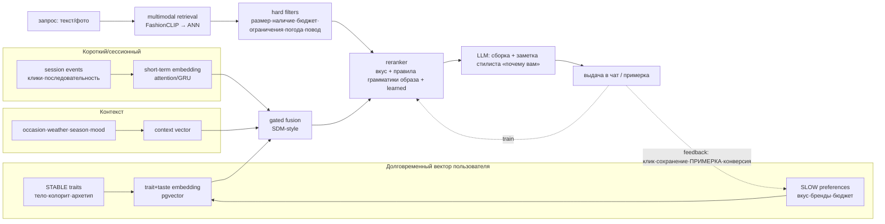

# Style Passport и модель рекомендаций — требования из методологии стилистов

**Версия:** 1.0 · синтез исследования (методология имидж-консалтинга + рекомендательные системы)
**Связано:** [PRD.md](./PRD.md) · [DEV_PLAN.md](./DEV_PLAN.md) · [Архитектурный блюпринт](https://claude.ai/code/artifact/f2e5ce4a-b08e-44aa-8e25-14fb79dccc68)
**Цель документа:** достроить структуру данных Style Passport, требования к онбордингу и архитектуру модели рекомендаций, зашив в них опыт профессиональных стилистов/имиджмейкеров.

---

## 0. TL;DR — ключевые решения (для того, кто открыл первым)

1. **Кодируем реальный пайплайн стилиста**, а не «плоский квиз». AICI (главная профассоциация) делит работу пополам: **~50% — визуальный дизайн** (цвет, линия, масштаб, пропорция, силуэт) — это **вычисляется из фото**; **~50% — человеческий слой** (образ жизни, цели, психология, вкус) — это **спрашиваем**. Правило: *спрашивай человеческий слой, вычисляй визуальный*.

2. **Три слоя данных по скорости изменения** — это архитектурное сердце ответа на «мода переменчива»:
   - **STABLE** (внешность, тело, колорит) — собираем один раз → долговременный профиль/эмбеддинг;
   - **SLOW** (вкус, бренды, бюджет, ценности) — дрейфует месяцами → долговременный эмбеддинг, обучается на истории;
   - **FAST** (повод, погода, сезон, настроение, текущая сессия) — считываем в момент запроса → короткий/сессионный эмбеддинг + контекст-вектор.
   Их **разделяет обучаемый gate** (какая часть долгого вкуса переживает сегодняшний повод).

3. **Честность как инженерный принцип (Tier-модель).** Колор-анализ, Kibbe, эссенции — **не наука**, а полезные эвристики с плохой межэкспертной надёжностью и евроцентричным биасом. Поэтому:
   - **Движок** работает на **непрерывных измеримых признаках** (ratio тела, CIE Lab кожи/волос/глаз, контраст) — Tier 1;
   - **Типологии** (сезон, Kibbe, эссенция) — только как **человекочитаемый ярлык в UX**, редактируемый пользователем, никогда как жёсткая истина — Tier 2;
   - **Псевдонаука** (сезон=личность, Dressing Your Truth) — только опциональный self-ID «для вкуса» — Tier 3.

4. **Парные значения «сейчас / хочу».** Каждый серьёзный intake стилиста спрашивает и «как тебя описывают» и «как хочешь, чтобы описывали»; и «любимая часть тела» и «нелюбимая». **Разрыв между парой — это и есть бриф на стайлинг.** Моделируем как парные поля.

5. **Жёсткие ограничения ≠ предпочтения.** «Без каблука», «только этичные бренды», «не ношу синтетику», размер, потолок бюджета — это **фильтры-исключения**, а не веса. Они убирают товар из выдачи, а не понижают.

6. **Петля обратной связи — главный страховочный трос надёжности.** Типологии слишком шумные, чтобы доверять им без присмотра (как у Stitch Fix: ИИ готовит шорт-лист, человек/фидбек правит). **Наша примерка — сильнейший сигнал этой петли**, которого нет ни у кого.

7. **Фото = биометрия (152-ФЗ)** + евроцентричный биас колор-анализа → согласие до анализа, 2-осевая модель тона кожи (не Fitzpatrick), рамка «подсказка, не диагноз», предупреждение об артефактах освещения.

---

## 1. Пайплайн стилиста, который мы кодируем

Профессиональная последовательность (консенсус AICI / theconceptwardrobe / imidzh-консалтинг-куррикулумы):

```
Lifestyle intake → Color analysis → Body/figure analysis → Style personality → Wardrobe audit → Gap list → Outfit formulas / Shopping
   (спрашиваем)      (вычисляем)        (вычисляем)          (спрашиваем+       (наш try-on/       (генерируем —
                                                              вычисляем)          виртуальный         то, чего у людей
                                                                                  шкаф)               нет формулы)
```

**Что каждый слой отвечает и чем управляет в «грамматике образа»** (ключевой инсайт: слои **ортогональны** — не конкурируют, а фильтруют разные оси):

| Слой | Вопрос | Управляет в рекомендации |
|---|---|---|
| **Lifestyle / повод / климат / бюджет** | «Что тебе *нужно*?» | Практический фильтр: доля категорий, дресс-код, погодоустойчивость, потолок цены |
| **Color season** | «Что тебе *идёт* по цвету?» | Палитра, уровень контраста, металлы (золото/серебро), лучшие нейтрали |
| **Body shape / Kibbe** | «Что тебе *идёт* по форме?» | Силуэт, линия, крой, акцент на талии, **масштаб** узора/деталей/аксессуаров, вес/драпировка ткани |
| **Style essence / персона** | «Что *ты* есть?» (идентичность) | Настроение/эстетика, орнаментика, в какой «правильный» силуэт склониться |
| **Context (повод/погода/настроение)** | «Что *прямо сейчас*?» | Ситуативный фильтр + сдвиг насыщенности цвета и формулы образа |

Практический вывод: **цвет и тело = «что тебе идёт» (объективно); стиль-персона = «что есть ты» (идентичность); lifestyle = «что тебе нужно» (утилита); контекст = «что сейчас».** Рекомендация — их пересечение.

---

## 2. Трёхслойная структура данных (по скорости изменения)

### Слой A — STABLE traits (собираем один раз, редко меняются)

Хранить на **профиле** (не на сессии). Движок — на непрерывных признаках (Tier 1); типологии — производные ярлыки (Tier 2), редактируемые.

**Внешность / колорит (вычисляем из фото + опрос-подтверждение):**
- `skin_lab` {L*, a*, b*} — **2 оси: lightness + hue** (не одна Fitzpatrick — иначе биас на тёмной коже)
- `hair_lab`, `eye_lab`
- `contrast_level` {low, medium, high} — производная метрика (разница кожа/волосы/глаза)
- `undertone` {warm, cool, neutral, olive} — 4 категории, не бинарно
- Производный ярлык (Tier 2): `color_season_canonical` + `aliases[]` — **имена сезонов не стандартизированы** (True/Cool/Deep у разных школ различаются) → хранить canonical-ключ + алиасы. Каждый сезон = `(hue, value, chroma, dominant_axis)`
- `palette_hex[]` — итоговая палитра (swatch + role: neutral/accent/metal)

**Тело (вычисляем из измерений/CV; храним ratio, не только ярлык):**
- Обхваты: `bust`, `waist`, `hips`, `shoulders`, `high_hip` + рост, inseam, rise, wrist
- Производные ratio (движковые): `whr`, `waist_to_bust`, `shoulder_to_hip`, `leg_to_height`, `wrist_to_height`
- `body_shape` (enum, вычисляется по порогам **5%/25%**): `hourglass | pear | apple | rectangle | inverted_triangle` (+ подтипы-флаги: `top_hourglass, bottom_hourglass, spoon, diamond, figure_8`)
- `vertical_proportion` {short_torso_long_legs, balanced, long_torso_short_legs} · `waist_placement` {high, balanced, low} · `horizontal_proportion` {top_heavy, balanced, bottom_heavy}
- `scale` = `height_band` {petite, average, tall} × `frame_size` {small, medium, large}
- Проприетарный опциональный слой (Tier 2, self-ID): `kibbe_type` (13→10, с флагом `pure_deprecated`), `kibbe_family`

**Стиль-архетип (спрашиваем + можно вычислять с фото; хранить БЛЕНДОМ, не одним ярлыком):**
- `style_essences[]` — **взвешенный блендом** по 7 непроприетарным эссенциям McJimsey/Kitchener: `dramatic, natural, gamine, classic, ingenue, romantic, angelic`
- `yin_yang_score` — скаляр (−1 yang … +1 yin)
- `style_keywords[]` — прилагательные вкуса (bold, delicate, timeless, edgy…)

### Слой B — SLOW preferences (дрейфует месяцами)

Хранить как **версионируемый** профиль (SCD-подобно); обучается и на явном вводе, и на поведении.

- `style_persona_blend[]` — эстетики как **taste-вектор** (minimalist, old_money, streetwear, romantic, bohemian, sporty, edgy…) — это **self-report/поведение**, честно кодируется
- `brands_love[]`, `brands_avoid[]`
- `budget_by_category{}` — тиры per-item (не одна цифра): напр. верх, низ, обувь, верхняя, сумки
- `size_by_category{}` — размеры по категориям (не один размер)
- **Lifestyle pie** `lifestyle_allocation{}` — % времени по поводам (см. enum ниже), сумма 100
- `dress_code_work` (ординальный enum формальности)
- `climate_zone` / `location`
- `fit_prefs{}` — rise, sleeve, neckline, stretch tolerance, slim/regular/relaxed
- **Парные поля «сейчас/хочу»**: `style_self_described` vs `style_aspirational`; `body_love[]` vs `body_downplay[]` — *разрыв = бриф*
- `inspiration` — иконы стиля, мудборд-изображения, «всегда хотела носить, но…»
- **HARD CONSTRAINTS** (исключающие фильтры, не веса): `no_heels`, `heel_max_cm`, `ethical_only`, `no_fur`, `no_synthetics`, `modest`, `fabric_aversions[]`
- `desired_mood_default` — базовое желаемое ощущение (confident / comfortable / energized / authoritative)
- `life_stage` + `body_stability_flag` — беременность/постпартум/менопауза/смена веса/новая работа → биас к адаптивным вещам (стрейч, регулируемая талия)

### Слой C — FAST context (на каждый запрос/сессию)

Хранить как **события** (event stream), не на профиле.

| Сигнал | Как дёшево собрать | Кодирование |
|---|---|---|
| **Повод** (высший приоритет) | Явный тап-чип «Какой повод?» (работа/свидание/вечеринка/спорт/свадьба/повседневное) | low-card categorical → pre-filter или feature |
| **Погода** | Weather API по геолокации (browser geo → lat/lon; IP-фолбэк без пермишена), кэш по городу ~1ч | temp bucket, precip flag, condition, feels-like |
| **Сезон/дата** | Выводим из даты+полушария — 0 ввода | season one-hot + month sin/cos |
| **Сессия/поведение** | Уже есть: последовательность действий и тапов в чате | seq → short-term эмбеддинг (GRU/attention) |
| **Настроение** | Опциональный emoji/mood-чип — **только явно** | categorical (НЕ инференс по лицу: 152-ФЗ + биас) |
| **Бюджет здесь-и-сейчас** | Явный слайдер в запросе | numeric, hard cap |

---

## 3. Схема Style Passport (конкретика)

Три таблицы по слоям + каталог-зеркало. Postgres (уже в стеке) + `pgvector`.

```sql
-- STABLE: меняется редко; храним измеримое + производные ярлыки
user_traits (
  user_id PK,
  -- colorimetry (движок)
  skin_l, skin_a, skin_b, hair_l, hair_a, hair_b, eye_l, eye_a, eye_b  numeric,
  contrast_level        text,        -- low|medium|high
  undertone             text,        -- warm|cool|neutral|olive
  color_season_key      text,        -- canonical; см. alias-таблицу
  palette_hex           jsonb,       -- [{hex, role}]
  -- body (движок: ratio; ярлыки производные)
  measurements          jsonb,       -- {bust,waist,hips,shoulders,high_hip,height,inseam,rise,wrist}
  ratios                jsonb,       -- {whr, waist_to_bust, shoulder_to_hip, leg_to_height, wrist_to_height}
  body_shape            text,        -- + body_shape_subtypes text[]
  vertical_proportion   text, waist_placement text, horizontal_proportion text,
  height_band text, frame_size text,
  kibbe_type            text NULL,   -- Tier 2, self-ID опционально
  -- archetype (бленд, не один ярлык)
  style_essences        jsonb,       -- [{essence, weight}]
  yin_yang_score        numeric,
  trait_embedding       vector(768), -- долговременный «кто ты» вектор
  photo_consent_id      uuid,        -- FK на согласие 152-ФЗ (см. PRD S6a)
  updated_at timestamptz
)

-- SLOW: версионируем (SCD-2 стиль) — важно для «мода дрейфует»
user_preferences (
  id PK, user_id, valid_from, valid_to,        -- история изменений
  style_persona_blend  jsonb,   -- taste-вектор эстетик
  brands_love text[], brands_avoid text[],
  budget_by_category jsonb, size_by_category jsonb,
  lifestyle_allocation jsonb,   -- {occasion: pct}
  dress_code_work text, climate_zone text,
  fit_prefs jsonb,
  style_self_described text[], style_aspirational text[],  -- парные
  body_love text[], body_downplay text[],                 -- парные
  hard_constraints jsonb,       -- {no_heels, heel_max_cm, ethical_only, ...}
  desired_mood_default text,
  life_stage text, body_stability_flag bool,
  taste_embedding vector(768)   -- долговременный «вкус» вектор (обучается на истории)
)

-- FAST: события; питают короткий/контекстный вектор и обучение
context_events (
  id PK, user_id, session_id, ts,
  occasion text, weather jsonb, season text, mood text,
  budget_cap numeric, geo jsonb,
  session_seq jsonb            -- последовательность действий (для short-term эмбеддинга)
)

-- Каталог-ЗЕРКАЛО: атрибуты товара должны совпадать с осями паспорта,
-- иначе матчить нечем (это и есть «обогащение каталога» из блюпринта)
product_attrs (
  product_id PK,
  palette_hex jsonb, dominant_colors jsonb, warmth text, value_level text, chroma text,
  silhouette text, line text, structure text,   -- для body/Kibbe-матчинга
  scale text, waist_definition text,
  fabric text, stretch bool, weight text,
  occasion text[], formality text, seasons text[], weather_ok jsonb,
  ethical_flags jsonb, heel_cm numeric,
  attr_embedding vector(768),   -- мультимодальный (FashionCLIP)
  data_quality_score numeric
)
```

**Enum'ы (enum-ready из исследования):**
- `occasion` (два измерения `domain × formality`): domain {work, social, sport, home, special_occasion, travel} × formality-ординал {relaxed_casual, smart_casual, business_casual, professional, dressy, formal}. Плюс канонический суперсет: `work_professional, work_business_casual, casual_everyday, social_smart_casual, social_dressy, formal_eveningwear, special_occasion, active_gym, at_home_loungewear, travel, family_caregiving`
- `dress_code` (ординал, Emily Post): `casual < dressy_casual < smart_casual < business_casual < semi_formal < business_formal < cocktail < festive < black_tie_optional < black_tie < white_tie` — **порядок load-bearing** для матчинга повода
- `wardrobe_sort` (для будущего виртуального шкафа): `keep, keep_with_alterations, repair, maybe, seasonal_store, sell, donate, recycle, toss`

**Правило ≥25%:** повод с долей времени ≥25% → категория получает «базовый» гардероб; <25% → только occasional/specialty. Это единственный количественный якорь из литературы; **сам маппинг «% → число вещей» люди не формализовали — это открытый gap, который наш ИИ может занять.**

---

## 4. Онбординг: что собирать и как

**Принципы (из intake стилистов + вирусного паттерна):**
- **Lifestyle-first, не clothes-first.** «Как выглядит твоя обычная неделя?» — самый важный первый вопрос, до любых вопросов про одежду.
- **Прогрессивно, до регистрации, всё Skippable** (паттерн Daydream/онбординг-до-auth). Порог входа минимальный.
- **Виральный хук — «Style Passport из селфи»** как identity-card инфографика (портрет + swatch-палитра + сезон + do/okay/don't + пара знаменитостей-референсов). Это самый расшариваемый формат; но (см. §6) — с согласием и рамкой «для вкуса».
- **Спрашивай мало, но с высоким сигналом**; тяжёлое (замеры, фото) — опционально и позже, чтобы не ронять конверсию.

**Минимальный high-signal набор (шаги онбординга, мапится на PRD 4a–4c):**
1. **Для кого / повод жизни** (пол, «обычная неделя» → lifestyle pie грубо) — человеческий слой
2. **Стиль-пресеты** фото-карточками (выбор 1–3 эстетик) → `style_persona_blend`
3. **Бренды** от выбранных стилей (чек-строки + поиск) → `brands_love`
4. **Парные вопросы идентичности** (лёгкие): «как тебя описывают / как хочешь» + «что любишь/прячешь в фигуре» → бриф
5. **Ограничения-дилбрейкеры** (без каблука / этично / без синтетики / скромно) → `hard_constraints`
6. **Размеры + бюджет** по категориям (плитки/слайдеры) — можно отложить
7. **Фото для паспорта** (опционально) → **consent-gate 152-ФЗ** → colorimetry + (опц.) сезон/архетип

**Метод «три слова» (Bornstein)** — отличная лёгкая механика для чата: практическое слово (из того, что носишь) + аспирационное (идеал) + эмоциональное (как хочешь себя чувствовать). Ровно ложится в парные поля и в `desired_mood_default`.

**Что НЕ переспрашивать** (роняет конверсию): точные обхваты на старте (берём диапазон/размер), длинные текстовые поля, всё что можно вывести (сезон-погода из локации, часть вкуса — из первых кликов).

---

## 5. Архитектура модели рекомендаций

### 5.1 Общая петля (retrieval-first + context-aware, поверх блюпринта)



### 5.2 Пять компонентов

1. **Hard filters (context pre-filtering + constraints).** Первым делом *исключаем* невозможное: нет размера/наличия, выше потолка бюджета, нарушает `hard_constraints` (каблук, этика, ткань), не по погоде (сарафан при −10°), не по поводу. Дёшево, сразу поднимает релевантность.
2. **Multimodal retrieval.** Запрос (текст/фото) → FashionCLIP-эмбеддинг → ANN в pgvector → сотни кандидатов. Решает холодный старт (контент-based).
3. **«Грамматика образа» как rule-engine (Tier 2, мягкие веса).** Кодируем предписания стилистов как **фичи/бусты, редактируемые пользователем**:
   - color season → буст товаров в палитре/контрасте/металле;
   - body shape/Kibbe → буст силуэта/линии/масштаба/акцента на талии;
   - essence/persona → буст настроения/орнаментики.
   Каждое правило — мягкий вес, не жёсткий фильтр (кроме `hard_constraints`).
4. **Learned reranker + gated fusion.** Поверх правил — обучаемый реранкер. Долговременный вектор (STABLE+SLOW) и короткий (сессия) + контекст-вектор сливаются **обучаемым gate (SDM-style)**: gate решает, *какая часть долгого вкуса переживает сегодняшний повод* (на свадьбу — сдвиг к dressy даже если обычно casual). Фичи компатибилити — из линии GP-BPR/PAI-BPR (общая сочетаемость + личное предпочтение, с объяснимостью по атрибутам).
5. **LLM-сборка + заметка стилиста.** LLM собирает подборку в разговорный ответ с обоснованием «почему это вам» (наша механика 1e). Объяснение берёт причины из атрибутов (палитра/силуэт/повод) — это и UX, и доверие.

### 5.3 Поэтапный роллаут (как у Daydream — от простого)

| Фаза | Рекомендации | Контекст |
|---|---|---|
| **MVP** | Чистый retrieval (FashionCLIP) + hard-filters + rule-engine грамматики образа + LLM-сборка | **Post-filtering**: реранк по явному occasion-чипу + погодно-сезонный pre-filter. Ноль изменений модели, сразу собирает occasion-лейблы |
| **Рост** | + learned reranker (напр. CatBoost/DeepFM); фичи: совпадение вкуса, палитра, силуэт, **факт примерки**, сохранения | **Contextual modeling**: occasion/weather/season/mood как feature-поля в Factorization Machine/DeepFM — одна модель, дёшево на инференсе |
| **Масштаб** | + **gated fusion** долгого вектора (STABLE+SLOW в pgvector) и короткого сессионного (клик-стрим). «Знает моё тело и вкус» × «знает, что я ищу сегодня» | Long/short separation (SDM/SIM-паттерн) |

### 5.4 Каталог-зеркало (обязательное условие)

Матчить не с чем, если у товара нет тех же осей, что у паспорта. Поэтому **обогащаем каталог LLM'ом** (как Daydream): достаём скрытые атрибуты (силуэт, вырез, палитра, повод, погодопригодность, стрейч, этичность, высота каблука) и мультимодальный эмбеддинг. Это связка §3 `product_attrs` ↔ `user_traits`/`user_preferences`.

### 5.5 Петля обратной связи = страховка надёжности

Типологии шумные → доверяем не им, а поведению (модель Stitch Fix: ИИ готовит шорт-лист, фидбек правит). Сигналы в петле по силе: **примерка > сохранение > клик > просмотр**. Примерка обучает реранкер точнее любого конкурента и напрямую растит CPA-конверсию. Конверсия (S2S postback) замыкает `SLOW`-профиль и обучение.

---

## 6. Честность, биас, 152-ФЗ (must-have, не полировка)

- **Рамка «подсказка / для вкуса», не «научная истина».** Колор-анализ и Kibbe не имеют рецензируемых доказательств; надёжная только *общая* связь «одежда/посадка влияет на впечатление» (Howlett & Pine 2013), не конкретные правила. Не навязываем ярлык — показываем как редактируемую гипотезу.
- **Движок на измеримом, ярлык — в UX.** Никогда не пускаем «сезон/Kibbe» как жёсткий вход движка; вход — непрерывные ratio/Lab/контраст. Ярлык — человекочитаемый слой, который пользователь может переопределить (снимает и проблему надёжности, и евроцентричный/гендерный биас происхождения систем).
- **Биас на тёмной коже — крупнейший задокументированный риск.** Fitzpatrick (одна ось) скрывает биас → используем **2 оси (lightness + hue)** (Sony AI). Аудит палитр на глубоких/тёплых/холодных тонах обязателен.
- **Артефакт освещения.** Ярлык может отражать свет на фото, а не человека → требуем нормального света, предупреждаем, не позиционируем как точный диагноз.
- **152-ФЗ: фото/лицо = биометрические ПДн.** Согласие **до** анализа (наш consent-gate S6a), версионирование, хранение в РФ, удаление в один тап. **Настроение — только явный чип, без инференса по лицу** (иначе физиогномика + биометрический бремя).

---

## 7. Что мы делаем лучше людей и Daydream

1. **Маппинг «% образа жизни → число вещей»** — у стилистов формулы нет (только якорь ≥25%). Наш ИИ может её вывести на данных — это наш потенциальный дифференциатор.
2. **Контекст-осознанность** (погода/повод/настроение как first-class сигнал) — статичные паспорта и Daydream этого не делают.
3. **Примерка как сигнал** — сильнейшая обратная связь, замыкает петлю точнее любого конкурента; у Daydream её нет вообще.
4. **Заметка стилиста «почему вам»** (1e) — объяснимость, которой нет у Daydream.
5. **Парные «сейчас/хочу»** — бриф на трансформацию, а не только «что тебе идёт сейчас».

---

## 8. Открытые вопросы

- Гендер/сегмент на старте: женский-first (большинство методологии откалибровано на женском гардеробе) или сразу оба?
- Насколько глубоко пускаем фото-анализ в MVP vs. отложить (юр-риск/биас vs. виральность)?
- Виртуальный шкаф (wardrobe audit) — фаза 2 или сразу (сильный сигнал, но тяжёлый онбординг)?
- Формула «% → число вещей» — исследовательский трек (наш потенциальный IP).
